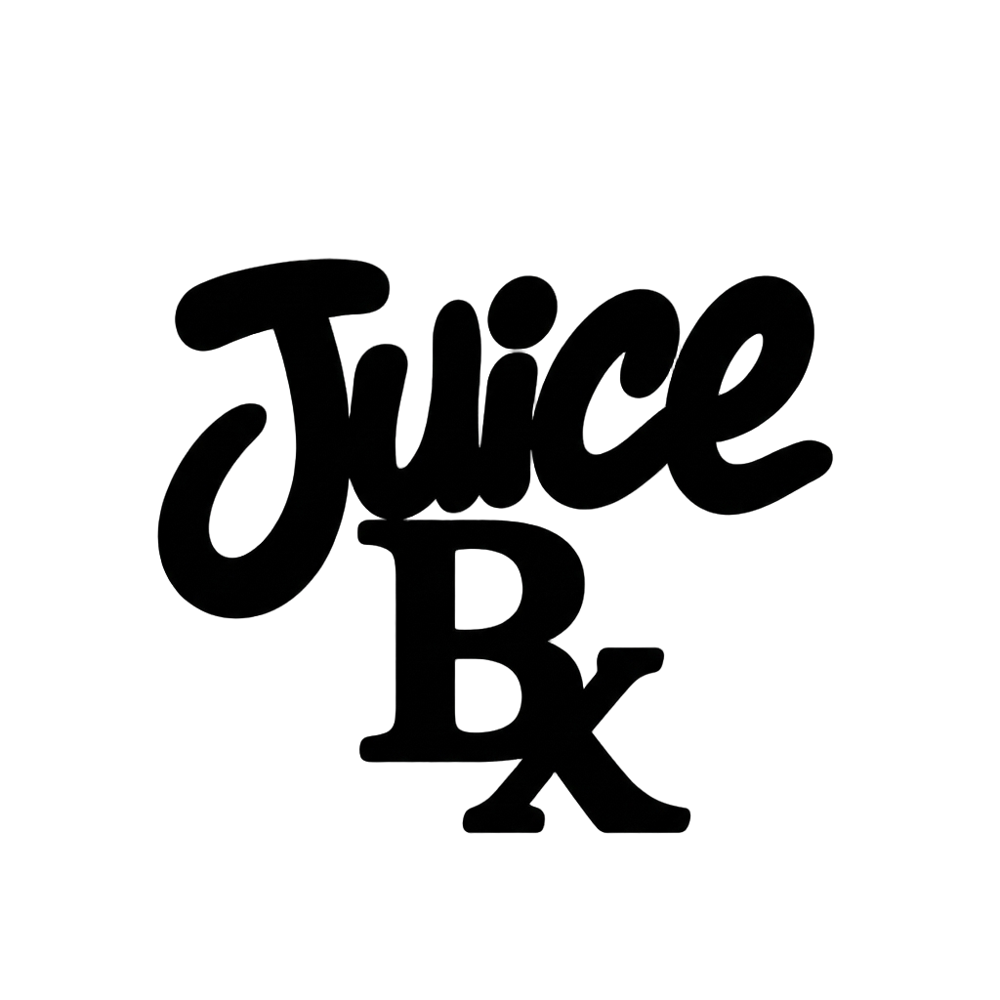

  

<h1 align="center">🧃 JuiceBx</h1>

  <b>The Juice Box. Where you get the juice from. 🎵</b> 
  <i>Dedicated to the eternal legacy of Juice WRLD. Zero ads. Zero bloat. Pure audio.</i>

  <a href="https://juicebx.onrender.com/">🔴 <b>Live Web Player (Render)</b></a> •
  <a href="https://jerjerrydrive-code.github.io/juicebx/">🌐 <b>GitHub Pages Mirror</b></a> •
  <a href="https://jerjerrydrive-code.github.io/juicebx/creation/install.html">🐇 <b>Rabbit r1 Install Card</b></a>

---

## 🕊️ In Loving Memory of Jarad Anthony Higgins (Juice WRLD)
### *December 2, 1998 – December 8, 2019*

  

> *"999 represents taking whatever ill, whatever bad situation, whatever struggle you’re going through and turning it into something positive to push yourself forward."*  
> — **Jarad Higgins (Juice WRLD)**

JuiceBx wasn't just built to play music. It was built as a living tribute to **Jarad Anthony Higgins** — a generational artist, poetic genius, and vulnerable soul whose music became a lifeline for millions across the world battling anxiety, heartbreak, and inner demons.

From timeless classics like *Lucid Dreams*, *All Girls Are the Same*, *Robbery*, *Legends*, and *Righteous*, to his legendary unreleased vault of over 3,000 freestyles and studio sessions, Jarad transformed his pain into anthems of healing and connection. He showed every listener that they were never alone in the dark.

**JuiceBx is created in that exact spirit: 999 Forever.**

---

## 💧 What is JuiceBx?

You know when you were a kid and you'd grab a juice box, poke the straw in, and just *vibe*? That's this — except the juice is pure music and the box is your screen. No ads. No subscriptions. No tracking. No bloat. Just press play and get the juice. **Yuh dig. 🧃**

### The Journey & AI Revival
This project started with a singular goal: build the smoothest, most visually mesmerizing music experience on the web without relying on bulky corporate tech stacks. **Artificial intelligence helped breathe new life into the vision** — stress-testing edge cases, auditing viewport responsiveness, optimizing audio reactivity, and polishing hardware-accelerated animations into a pure, standalone audio deck.

---

## 🔥 Key Features

- 🎚️ **Material 3 & iOS 28-Wave Equalizer** — High-precision, real-time Web Audio API frequency visualizer that animates smoothly with bass and treble dynamics.
- 🎨 **338 ColorHunt Dynamic Theme Engine** — Hand-curated 4-color palette matrix featuring 34% translucent ambient light washes, live swatch strip, and 1-click random palette generator.
- ⚡ **Instant Discography & Vault Shuffles** — Streamlined 0ms playback for official albums and unreleased grails with zero buffering delay.
- 📋 **1-Tap Queue Management** — Dedicated dock button with real-time queue count badge and high-contrast controls for effortless playlist navigation.
- 💾 **Offline Download Storage** — Save your favorite tracks locally via IndexedDB with glowing visual indicators and instant offline playback.
- 🔍 **Instant Universal Search** — Lightning-fast track discovery across full discographies and curated genre catalogs with clean circular controls.
- 🐇 **Rabbit r1 & Mobile Native Design** — Responsive viewport optimization with support for touch swipe gestures, hardware wheel scrolling, and standalone PWA installation.
- ⚡ **Zero-Framework Architecture** — 100% vanilla HTML5, Tailwind CSS, and modular ES6+ JavaScript. No bloated build steps or third-party tracking.

---

## 🐇 Install on Rabbit r1

JuiceBx is built native-ready for handheld AI devices like the **Rabbit r1**:

1. Open **Creations** on your Rabbit r1.
2. Point your camera at the QR code on the [JuiceBx Install Page](https://jerjerrydrive-code.github.io/juicebx/creation/install.html).
3. Tap install — your device will load JuiceBx with full touch, wheel, and audio controls.

---

## 🚀 Live Experience

Experience JuiceBx right in your browser on phone, tablet, desktop, or handheld:

👉 **[https://juicebx.onrender.com/](https://juicebx.onrender.com/)**

---

## 📜 Open Source License

Distributed under the [MIT License](LICENSE). Take the juice, share the juice, remix the juice. Keep the 999 energy alive.

  🕊️ <b>999 FOREVER • LONG LIVE JUICE WRLD</b> 🕊️

